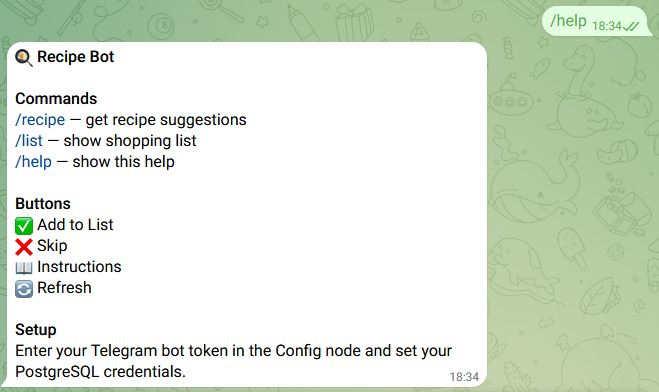
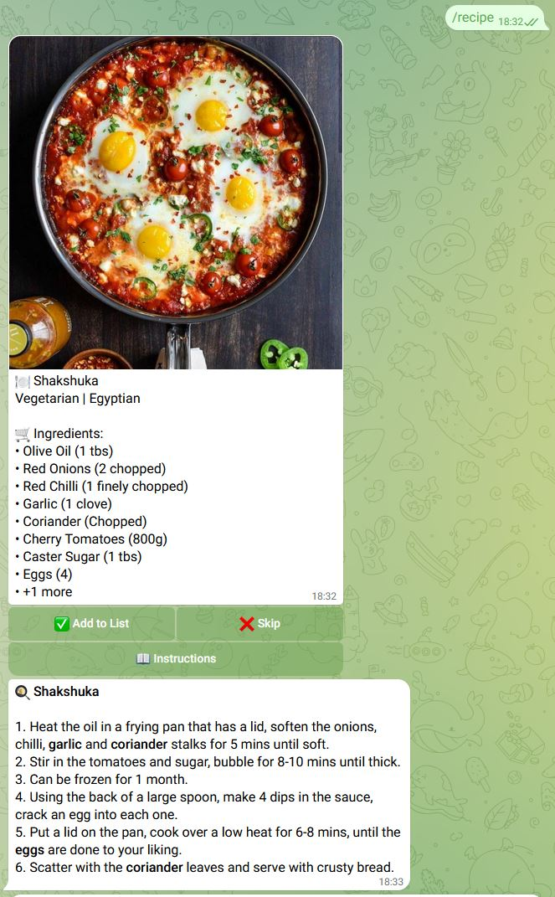
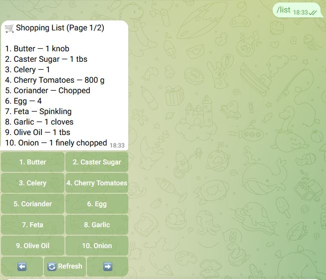

# About this project
 
The goal was to build a simple but practical Telegram recipe and shopping list bot for n8n.
The bot fetches recipe suggestions from **TheMealDB API** and allows you to preview ingredients, view cooking instructions, and add ingredients from a recipe directly to a persistent shopping list stored in PostgreSQL.

Right now the repository contains the **base version using metric units and English ingredient names**.

I'm considering creating two additional variants:

- a version using **imperial units**
- a version with **German ingredient names**

Whether I build and maintain these variants will depend on the interest this project receives.

Thanks for checking out the project.

# A Telegram recipe and shopping list bot for n8n.

# Features
- recipe suggestions
- ingredient preview
- shopping list with inline buttons
- instructions view
- PostgreSQL persistence

# Setup
1. Import the workflow JSON into n8n
2. Enter your Telegram bot token in the Config node
3. Set PostgreSQL credentials
4. Run the setup node
5. Activate the workflow
6. Use /help

# Commands
- /recipe
- /list
- /help
  
## Demo

  
  
  

#
This is the first project I’ve published publicly on GitHub. 
If you like this project, consider leaving a ⭐ - it would be greatly appreciated :)
